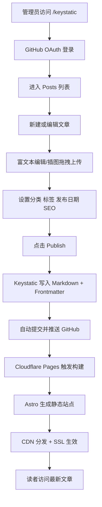

# 个人博客网站 PRD（V1.0）

## 1. 项目概述

### 1.1 项目目标

构建一个具备以下能力的个人博客系统：

- 采用 **Astro** 实现极速静态页面加载与优秀 SEO。
- 集成 **Keystatic** 提供“类 Word”的可视化编辑体验。
- 全站部署在 **Cloudflare Pages 免费额度**，实现低成本（目标：0 元）长期运行。
- 通过 GitHub 作为内容源，发布即提交 Commit，自动触发构建上线。
- 支持自定义域名、CDN 加速与 SSL 全站 HTTPS。

### 1.2 核心价值

- **内容生产效率高**：非技术用户也可通过可视化界面完成写作、排版、插图与发布。
- **技术稳定性强**：静态站点 + CDN，天然高性能、低运维风险。
- **成本几乎为零**：利用 GitHub + Cloudflare 免费层实现完整闭环。
- **可迁移性高**：内容以 Markdown/Frontmatter 存储，避免平台锁定。

### 1.3 成功指标（KPI）

- 页面首屏加载（LCP）≤ 2.5s（移动端主流网络）。
- 内容发布成功率 ≥ 99%（CMS 发布到线上可见）。
- 博客后台可用性 ≥ 99.5%（不含 GitHub/Cloudflare 平台故障）。
- SEO 基础项（title/description/canonical/sitemap）覆盖率 100%。

## 2. 用户与场景

### 2.1 目标用户

- 博主本人（管理员）：负责写作、编辑、发布、归档。
- 访客读者：浏览文章、按分类和标签检索内容。

### 2.2 核心使用场景

1. 管理员登录 `/keystatic`，新建文章并进行富文本编辑。
2. 拖拽上传文章配图，自动保存到仓库指定目录。
3. 设置分类、标签、发布日期、SEO 字段。
4. 点击发布后自动生成 Git Commit 并推送到 GitHub。
5. Cloudflare Pages 自动构建并更新站点。
6. 读者在自定义域名访问最新文章（含暗色模式与代码高亮）。

## 3. 信息架构与页面范围

### 3.1 前台页面（Astro）

- `/`：首页（最新文章列表、置顶、分类入口）
- `/posts/[slug]`：文章详情页
- `/categories/[category]`：分类聚合页
- `/tags/[tag]`：标签聚合页
- `/archives`：归档页（按年月）
- `/about`：关于页（可选）
- `/404`：错误页
- `/rss.xml`、`/sitemap.xml`：SEO/订阅支持

### 3.2 后台页面（Keystatic）

- `/keystatic`：登录入口 + 内容管理界面
- Collection：`posts`（文章集合）
- 可选 Singleton：`site`（站点配置，如站点名、描述、社交链接）

## 4. 用户流程图（写作到发布全链路）



## 5. 功能规格

### 5.1 后台编辑器（/keystatic）

#### 5.1.1 登录与权限

- 支持 GitHub OAuth 登录。
- 仅白名单账号可写入（Owner/指定协作者）。
- 未登录用户访问 `/keystatic` 时提示登录。
- 非授权用户禁止发布（只读或拒绝）。

#### 5.1.2 文章管理

- 支持 `新建 / 编辑 / 删除 / 草稿 / 发布`。
- 列表支持按标题、分类、标签、状态、发布日期筛选。
- 可视化字段编辑：标题、摘要、封面图、分类、标签、发布日期、SEO 信息。
- Slug 自动生成（可手动覆盖，需唯一校验）。

#### 5.1.3 富文本与媒体

- 编辑体验接近 Word：标题层级、加粗、斜体、列表、引用、代码块、分隔线、链接。
- 支持 Markdown 源格式兼容。
- 图片拖拽上传，自动存储至仓库目录（如 `src/assets/posts` 或 `public/uploads`）。
- 图片插入后自动写入相对路径。
- 可配置图片大小限制（如 5MB）与格式（jpg/png/webp）。

#### 5.1.4 发布机制

- 点击“发布”触发：
  1) 校验必填项；
  2) 写入 Frontmatter 与正文；
  3) 生成 Git Commit（标准 message）；
  4) Push 到 GitHub 默认分支；
  5) Cloudflare Pages 自动构建。
- 失败处理：显示失败原因（OAuth 失效、Push 权限不足、构建失败）并支持重试。

### 5.2 前端展示（博客站点）

#### 5.2.1 响应式设计

- 断点建议：`<768` 手机，`768~1024` 平板，`>1024` 桌面。
- 列表与正文排版在移动端保持可读性（行宽、字距、代码块横向滚动）。

#### 5.2.2 主题与体验

- 支持 Dark Mode（系统跟随 + 手动切换 + 本地持久化）。
- 提供基础阅读体验优化：目录（可选）、阅读进度、代码复制按钮（可选）。

#### 5.2.3 内容渲染

- 文章来源为 Markdown。
- 支持语法高亮（Shiki/Prism 任一）。
- 支持常见扩展（表格、任务列表、脚注可选）。
- Frontmatter 字段驱动页面 SEO 与文章元信息展示。

#### 5.2.4 SEO 基础能力

- 每篇文章可配置：`seoTitle`、`seoDescription`。
- 默认 fallback：无 `seoTitle` 则用文章 `title`。
- 自动输出 `sitemap.xml`、`robots.txt`、canonical。
- Open Graph/Twitter Card 元信息支持。

### 5.3 自动化与可观测性

- GitHub 为唯一内容源（单向可信来源）。
- Cloudflare Pages 监听仓库分支（如 `main`）自动构建。
- 每次发布对应可追踪 Commit。
- 构建日志可在 Cloudflare Pages 查看并定位失败原因。
- 建议接入基础站点分析（Cloudflare Web Analytics，免费）。

## 6. 数据结构设计（posts Schema）

以下为内容文件规范（Markdown + YAML Frontmatter）：

```md
---
title: "Astro + Keystatic 搭建记录"
slug: "astro-keystatic-setup"
excerpt: "从零实现可视化编辑与免费部署的实践总结"
cover: "/uploads/astro-keystatic-cover.webp"
category: "技术"
tags: ["Astro", "Keystatic", "Cloudflare"]
status: "published" # draft | published
publishedAt: "2026-03-08T10:30:00+08:00"
updatedAt: "2026-03-08T10:30:00+08:00"
seoTitle: "Astro + Keystatic + Cloudflare Pages 完整实践"
seoDescription: "一套零成本、可视化写作、自动发布的个人博客方案。"
canonical: "https://your-domain.com/posts/astro-keystatic-setup"
---

正文内容（Markdown）...
```

Keystatic `posts` 建议字段（逻辑）：

- `title`：string，必填，<= 120
- `slug`：slug，必填，唯一
- `excerpt`：string，<= 200
- `cover`：image，选填
- `category`：select/string，必填
- `tags`：array<string>，选填，建议 <= 8
- `status`：enum(`draft`,`published`)
- `publishedAt`：datetime（published 时必填）
- `updatedAt`：datetime（自动写入）
- `seoTitle`：string，选填
- `seoDescription`：string，选填（建议 70~160 字符）
- `canonical`：url，选填
- `content`：document/markdown，必填

## 7. 非功能需求

- 性能：主页和文章页静态化输出，启用 Cloudflare CDN 缓存。
- 安全：全站 HTTPS，后台 OAuth 登录，最小权限原则。
- 可维护：内容与代码同仓库可追踪，支持回滚。
- 可扩展：后续可增加搜索、评论（如 Giscus）、多语言。

## 8. 部署指南（Cloudflare Pages）

### 8.1 仓库与分支

- 代码托管：GitHub
- 生产分支：`main`
- 预览分支：`develop`（可选）

### 8.2 Cloudflare Pages 构建配置

- Framework preset：`Astro`（或自定义）
- Build command：`npm run build`
- Output directory：`dist`
- Node 版本：建议 `18` 或 `20`（与 Astro 版本匹配）

### 8.3 环境变量（示例）

以下变量名按 Keystatic GitHub 模式常见实践给出，最终以项目 `keystatic.config.ts` 和官方文档为准：

- `KEYSTATIC_GITHUB_CLIENT_ID`
- `KEYSTATIC_GITHUB_CLIENT_SECRET`
- `KEYSTATIC_SECRET`
- `KEYSTATIC_GITHUB_REPO`（示例：`owner/repo`）
- `PUBLIC_SITE_URL`（示例：`https://your-domain.com`）

### 8.4 自定义域名与 SSL

- 在 Cloudflare Pages 绑定自定义域名（如 `blog.your-domain.com`）。
- DNS 托管在 Cloudflare，开启 Proxy（橙云）。
- SSL/TLS 设为 Full（Strict）。
- 自动启用 CDN 与 HTTPS 证书。

### 8.5 发布链路验证

1. 在 `/keystatic` 新建测试文章并发布。
2. 确认 GitHub 出现新 Commit。
3. 确认 Cloudflare Pages 出现构建记录且成功。
4. 访问线上 URL 验证文章可见、SEO 元标签正确。

## 9. 验收标准（UAT）

- 能在 `/keystatic` 完成登录、创建、编辑、删除、发布。
- 图片可拖拽上传并在文章中正常显示。
- 发布后 1 次提交触发 1 次自动构建，线上可见。
- 前台在手机/平板/桌面可正常阅读。
- Dark Mode 可切换并记忆。
- Markdown 与代码高亮显示正确。
- SEO 字段在页面源码中可见并生效。

## 10. 风险与约束

- 免费额度限制：Cloudflare Pages 构建次数、GitHub API 配额需关注。
- OAuth 配置复杂度：GitHub App/OAuth 回调地址错误会导致后台不可用。
- 资源膨胀：图片过大可能导致仓库增长过快，应加入压缩策略。
- 单人维护场景下需做好密钥管理与仓库备份。
