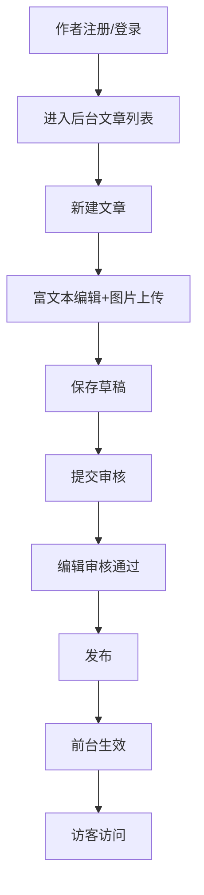

# 个人博客网站 PRD（V2.0）

## 1. 项目概述

### 1.1 项目目标

构建一个具备以下能力的个人博客系统：

- 前台采用 **Astro**，实现极速静态加载与优秀 SEO。
- 当前阶段采用 **独立创作者后台** 提供类 Word 的可视化编辑体验。
- 中长期升级为 **独立创作者后台**，支持注册登录、多作者和权限管理。
- 托管在 **Cloudflare Pages 免费额度**，实现低成本（目标：0 元）长期运行。
- 支持自定义域名、CDN 加速与 SSL 全站 HTTPS。

### 1.2 核心价值

- **内容生产效率高**：当前可视化写作可快速产出内容。
- **架构可演进**：后台可继续扩展审核、协作、统计等企业级能力。
- **运维成本低**：静态前台 + Cloudflare 生态，稳定且可扩展。
- **平台自主性强**：后续作者体系与权限流程由平台自主管理。

### 1.3 成功指标（KPI）

- 页面首屏加载（LCP）≤ 2.5s（移动端主流网络）。
- 内容发布成功率 ≥ 99%。
- 后台可用性 ≥ 99.5%（不含上游平台故障）。
- SEO 基础项（title/description/canonical/sitemap）覆盖率 100%。
- 多作者阶段：登录成功率 ≥ 99%，权限误放行率 = 0。

## 2. 用户与场景

### 2.1 角色定义

- `访客`：浏览文章。
- `作者`：创建和编辑自己的文章。
- `编辑`：审核与发布文章。
- `管理员`：管理用户、角色、站点配置。

### 2.2 核心场景

1. 作者注册并登录独立后台。
2. 作者新建文章，进行富文本编辑并上传图片。
3. 编辑审核后发布。
4. 发布内容自动在前台生效（动态读取或触发静态重建）。
5. 访客通过前台按分类、标签、归档浏览内容。

## 3. 信息架构与页面范围

### 3.1 前台页面（Astro）

- `/`：首页（最新文章）
- `/posts/[slug]`：文章详情
- `/categories/[category]`：分类页
- `/tags/[tag]`：标签页
- `/archives`：归档页
- `/about`：关于页
- `/404`：错误页
- `/rss.xml`、`/sitemap.xml`

### 3.2 后台页面（双阶段）

#### 阶段 A（当前）独立创作者后台

- `/admin`：后台入口
- `/admin/posts`：文章管理

#### 阶段 B（目标）独立创作者后台

- `/admin/login`：登录
- `/admin/register`：注册
- `/admin/posts`：文章列表
- `/admin/posts/new`：新建文章
- `/admin/posts/[id]`：编辑文章
- `/admin/review`：审核队列（编辑/管理员）
- `/admin/users`：用户与角色管理（管理员）
- `/admin/settings`：站点设置

## 4. 用户流程图（目标态）



## 5. 功能规格

### 5.1 后台编辑器

#### 5.1.1 基础能力

- 支持新建、编辑、删除、草稿、发布。
- 支持富文本编辑（标题、列表、引用、代码块、链接、图片）。
- 支持图片拖拽上传。

#### 5.1.2 注册登录与权限（阶段 B）

- 支持邮箱+密码注册/登录。
- 使用 HttpOnly Cookie + JWT 会话。
- RBAC 角色：`author` / `editor` / `admin`。
- 作者仅能操作自己的文章；编辑可审核；管理员可管理用户。

#### 5.1.3 审核与发布流程（阶段 B）

- 状态机：`draft -> review -> published -> archived`。
- 记录审核人、发布时间、更新时间。
- 支持发布失败重试与错误提示。

### 5.2 前端展示

- 响应式布局（手机/平板/桌面）。
- Dark Mode（跟随系统 + 手动切换 + 本地持久化）。
- Markdown/MDoc 渲染与代码高亮。
- 卡片统一尺寸、按发布时间倒序、首页仅展示最近 6 篇。

### 5.3 SEO 与可观测性

- 支持 per-post SEO 标题与描述。
- 自动生成 sitemap、robots、canonical。
- 接入 Cloudflare Web Analytics（可选）。

## 6. 数据结构设计

### 6.1 阶段 A（文件型内容，当前）

```md
---
title: "文章标题"
advanced:
  discriminant: true
  value:
    excerpt: "摘要"
    category: "技术"
    tags: ["Astro", "Cloudflare"]
    status: "published"
    seoTitle: "SEO 标题"
    seoDescription: "SEO 描述"
    canonical: "https://your-domain.com/posts/slug"
---

正文
```

### 6.2 阶段 B（数据库型内容，目标）

核心表：

- `users(id, email, password_hash, role, created_at)`
- `posts(id, author_id, title, slug, content, excerpt, status, published_at, updated_at)`
- `categories(id, name, slug)`
- `tags(id, name, slug)`
- `post_tags(post_id, tag_id)`
- `media_assets(id, uploader_id, file_url, mime, size, created_at)`

## 7. 技术架构与演进路线

### 7.1 当前架构（已落地）

- 前台：Astro
- 后台：独立创作者后台（账号系统 + 文章管理 API）
- 部署：Cloudflare Pages

### 7.2 目标架构（独立后台）

- 前台：Astro（保持）
- 后台/API：Cloudflare Workers + 独立 Admin UI
- 数据库：Cloudflare D1
- 媒体：Cloudflare R2

### 7.3 迁移策略

1. 保持前台不变，新增后台与 API。
2. 先实现认证+权限，再实现文章 CRUD 与审核。
3. 编写迁移脚本，将现有 Markdown 导入 D1。
4. 灰度切换数据源（DB 优先，文件兜底），稳定后完成历史数据迁移。

## 8. 部署指南（Cloudflare Pages）

### 8.1 构建配置

- Build command：`npm run build`
- Output directory：`dist`
- Node：18 或 20

### 8.2 环境变量（当前阶段）

- `PUBLIC_SITE_URL`
- `JWT_SECRET`

### 8.3 环境变量（目标阶段）

- `JWT_SECRET`
- `D1_DATABASE_ID` / 绑定名
- `R2_BUCKET` / 绑定名
- `PUBLIC_API_BASE_URL`

## 9. 验收标准（UAT）

### 9.1 当前阶段

- `/admin/posts` 可正常编辑与保存内容。
- 首页展示最近 6 篇，按发布时间倒序。
- 文章详情显示分类、发布时间、更新时间（含时分秒）。

### 9.2 目标阶段

- 支持注册、登录、退出。
- 权限控制正确：作者仅可管理自己的文章。
- 审核发布流程可用，发布后前台可见。

## 10. 风险与约束

- 当前本地文件存储方案适用于 MVP，生产阶段需迁移至 D1/R2 以保障一致性与扩展性。
- 免费额度约束：Cloudflare 构建次数、D1/R2 配额需监控。
- 安全要求提升：用户密码、会话、权限校验需严格实施。
- 迁移期需避免数据双写冲突。
